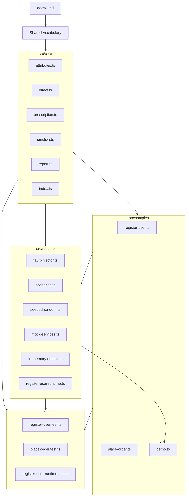
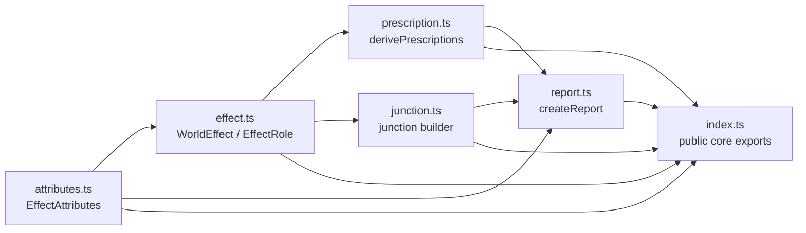
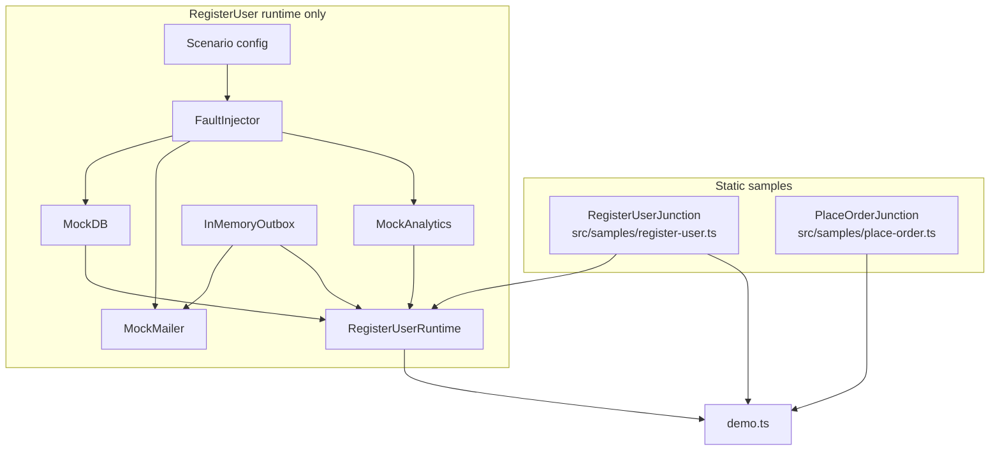
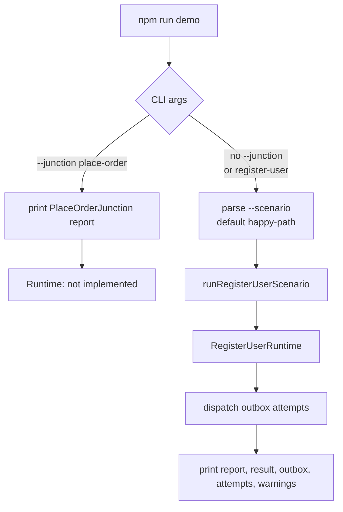
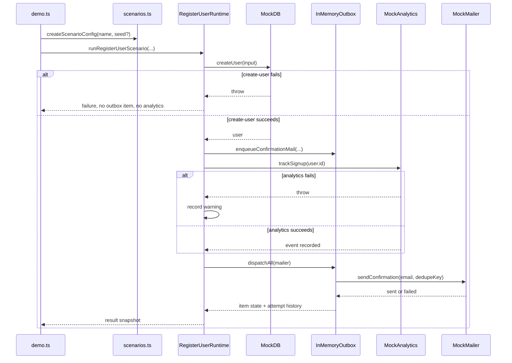
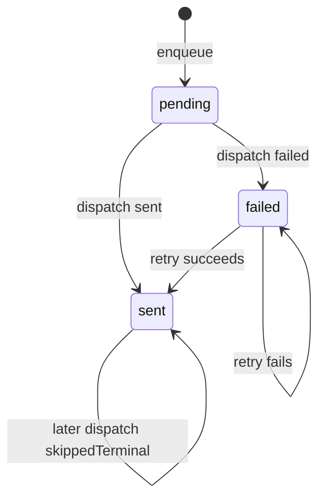
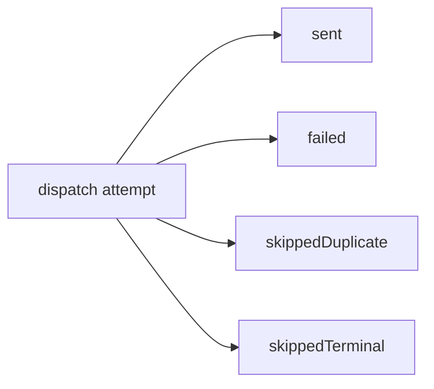
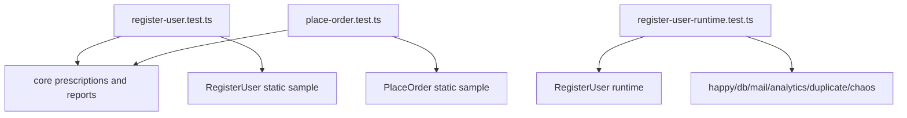

# Implementation Map

This document maps the current TypeScript implementation and its dependencies.

This is not a production workflow engine. The implementation is a small working sample of Effect Junction semantics. Runtime exists only for `RegisterUserJunction`. `PlaceOrderJunction` has a static model/report sample, but no runtime. Core types should remain independent from the mock runtime.

## Layer Map



## Core Dependency Map

`src/core` is the stable model layer. It should not import runtime, samples, tests, or CLI code.



Core responsibilities:

- define Effect Attributes and World Effects
- derive Prescriptions from attribute combinations
- build Junctions from static World Effects
- render reports from Junction metadata

Core non-responsibilities:

- execute side effects
- know about DB, mail, analytics, payments, or shipping
- know about demo CLI arguments
- model production workflow orchestration

## Sample And Runtime Map

`RegisterUserJunction` has both a static model and a deterministic mock runtime. `PlaceOrderJunction` currently has only a static model/report sample.



The runtime exists to demonstrate RegisterUser semantics:

- critical user creation
- outbox mail dispatch
- best-effort analytics
- deterministic failure scenarios
- outbox item state separated from dispatch attempt history

It does not generalize into a reusable queue, workflow, or effect runtime.

## Demo CLI Flow

`npm run demo` defaults to the RegisterUser happy path. `--junction place-order` prints the PlaceOrder static report and does not run a runtime scenario.



Supported RegisterUser scenario commands:

```sh
npm run demo
npm run demo -- --scenario happy-path
npm run demo -- --scenario db-fails
npm run demo -- --scenario mail-fails
npm run demo -- --scenario analytics-fails
npm run demo -- --scenario duplicate-dispatch
npm run demo -- --scenario chaos --seed 42
```

Supported PlaceOrder command:

```sh
npm run demo -- --junction place-order
```

## RegisterUser Runtime Flow



## Outbox State Model

The outbox distinguishes durable item state from dispatch attempt history.





In `duplicate-dispatch`, the item remains `sent` after the first successful dispatch. The second dispatch attempt records `skippedTerminal`, so the demo shows that a repeated dispatch happened without sending a second mail.

## Test Coverage Map



Tests intentionally avoid real external services.

## Dependency Rules

- `src/core` must stay independent from `src/runtime`.
- `src/samples` may depend on `src/core`.
- `src/runtime` may depend on `src/core` and RegisterUser sample metadata, but should remain RegisterUser-specific for now.
- `src/samples/demo.ts` may depend on samples and runtime because it is the CLI boundary.
- `src/tests` may depend on all layers.
- PlaceOrder has no runtime until explicitly implemented.
