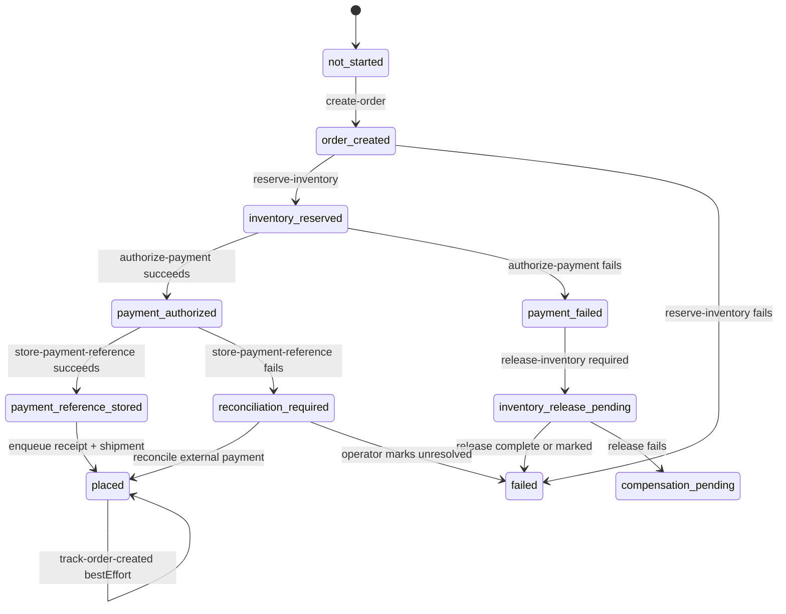
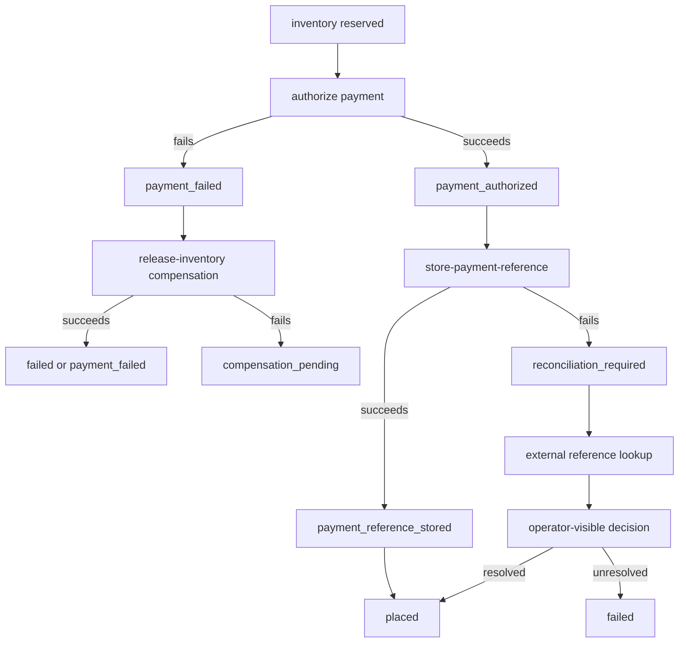

# Place Order Runtime Plan

This document is a plan for a future `PlaceOrderJunction` runtime sample.

It is not a payment framework. It is not a production workflow engine. It is a scenario-state plan for demonstrating Effect Junction semantics. Runtime implementation should wait until these states are explicit.

The goal is to reveal partial success, compensation, and reconciliation semantics before writing code.

Implementation status: all planned PlaceOrder runtime scenarios are implemented as educational deterministic mock slices. This is still not a payment framework or production workflow engine.

## Effects Involved

The static `PlaceOrderJunction` model currently includes:

| Effect | Role | Purpose |
| --- | --- | --- |
| `create-order` | `critical` | Create the local order record and operation identity. |
| `reserve-inventory` | `critical` | Reserve inventory before payment authorization. |
| `authorize-payment` | `compensating` | Mutate external payment state with a keyed request. |
| `store-payment-reference` | `critical` | Persist the external payment id locally. |
| `enqueue-receipt-mail` | `outbox` | Queue user-visible receipt mail with dedupe protection. |
| `enqueue-shipment-job` | `outbox` | Queue shipment work with keyed pending state. |
| `track-order-created` | `bestEffort` | Track analytics without deciding order success. |
| `reconcile-payment` | `reconciliation` | Repair split-brain local/external payment state. |

## State Model

These states are candidates for sample semantics. They are not a production order, payment, inventory, or fulfillment model.

### Order State

- `not_started`
- `order_created`
- `inventory_reserved`
- `payment_authorized`
- `payment_reference_stored`
- `placed`
- `payment_failed`
- `inventory_release_pending`
- `compensation_pending`
- `reconciliation_required`
- `failed`

### Payment State

- `not_requested`
- `authorized`
- `authorization_failed`
- `reference_missing`
- `compensation_required`
- `compensated`
- `reconciliation_required`

### Inventory State

- `not_reserved`
- `reserved`
- `release_pending`
- `released`
- `release_failed`

### Outbox State

- `receipt_pending`
- `receipt_sent`
- `receipt_failed`
- `shipment_pending`
- `shipment_enqueued`
- `shipment_failed`

## State Machine



## Scenario Matrix

| Scenario | Expected semantics | Final state |
| --- | --- | --- |
| `happy-path` | Order is created, inventory is reserved, payment is authorized, payment reference is stored, receipt mail is enqueued, shipment job is enqueued, and analytics runs as best effort. | `placed` |
| `inventory-reservation-fails` | Order is created, inventory reservation fails, payment is not attempted, receipt mail is not queued, and shipment job is not queued. | `failed` |
| `payment-authorization-fails` | Order is created, inventory is reserved, payment authorization fails, release-inventory compensation is required, receipt mail is not queued, and shipment job is not queued. | `payment_failed` or `failed` |
| `payment-succeeds-reference-store-fails` | Payment is authorized externally, local payment reference is not stored, rollback is insufficient, reconciliation is required, operator-visible diagnostic is recorded, and receipt mail is not queued until reconciled. | `reconciliation_required` |
| `receipt-mail-fails` | Order remains placed, receipt outbox item remains failed or pending, and retry requires a dedupe key. | `placed` |
| `shipment-job-fails` | Order remains placed or pending shipment depending on sample policy, shipment outbox item remains failed or pending, and retry requires keyed idempotency. | `placed` or shipment-pending |
| `analytics-fails` | Order remains placed, warning is recorded, and best-effort failure does not affect order success. | `placed` |

TypeScript state model note:

- `payment-authorization-fails` currently fixes `finalOrderState` as `payment_failed`.
- `shipment-job-fails` currently fixes `finalOrderState` as `placed`.
- These can be revised before runtime implementation if the sample policy changes.

## Compensation And Reconciliation Flow



## Compensation Is Not Rollback

DB rollback can undo local transactional state. Payment authorization cannot be undone by DB rollback.

Inventory release is an explicit compensating effect. Payment void, cancel, or refund would also be explicit compensating effects.

Compensation creates new real-world actions rather than erasing the old ones. A runtime sample should make those actions visible as states and diagnostics instead of hiding them behind a generic exception.

## Reconciliation

The key split-brain scenario is `payment-succeeds-reference-store-fails`.

In that case, the external provider may have authorized payment, while the local database may not have committed the payment id. The local system and external provider now disagree about what happened.

The runtime sample should represent this as `reconciliation_required`, not as a generic throw.

Reconciliation may need:

- external reference lookup
- operation id or idempotency key
- operator-visible alert
- scheduled job
- manual decision in unresolved cases

## Future Runtime Shape

These are documentation examples only. Do not implement them until the scenario-state plan is stable.

The demo CLI can display static scenario expectations:

```sh
npm run demo -- --junction place-order --scenario payment-succeeds-reference-store-fails
```

This still does not execute a PlaceOrder runtime.

```ts
type PlaceOrderScenario =
  | "happy-path"
  | "inventory-reservation-fails"
  | "payment-authorization-fails"
  | "payment-succeeds-reference-store-fails"
  | "receipt-mail-fails"
  | "shipment-job-fails"
  | "analytics-fails"

type PlaceOrderResult = {
  ok: boolean
  orderState: PlaceOrderState
  paymentState: PaymentState
  inventoryState: InventoryState
  warnings: string[]
  diagnostics: string[]
}

type PlaceOrderRuntimeSnapshot = {
  order: unknown
  payment: unknown
  inventory: unknown
  outbox: unknown
  analytics: unknown
}
```

## Implementation Gate

Before implementing PlaceOrder runtime, the repository should have:

- this state plan reviewed
- scenario names finalized
- expected final states decided
- compensation semantics decided
- reconciliation semantics decided
- no provider-specific payment behavior inside core

PlaceOrder runtime should remain an educational sample unless the repository intentionally changes direction.
